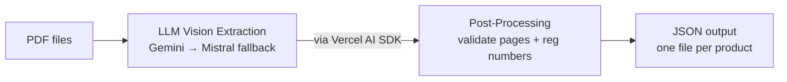

## Overall Strategy

Initially, I considered a normalized (parent-child) data structure since some Environmental Product Declaration (EPD) files contain multiple products. However, user research showed that users care more about the carbon footprint per individual product rather than the manufacturer. Therefore, I chose a **flat data structure** with duplicated manufacturer details. This also simplifies Part 2.

For data extraction, I evaluated three approaches:

1. **Text Extraction:** Using `pdf-parse` to find keywords (e.g., EPD registration, MPa).
2. **LLM Vision:** Using an LLM with OCR capabilities to extract data directly into a JSON schema.
3. **Hybrid Method:** Searching for keywords, taking screenshots of relevant pages, and extracting text only from those pages to save time and handle long PDFs.

### Why I chose Approach 2 (LLM Vision)

I selected the second approach for its simplicity and accuracy. Most EPDs are digital PDFs containing dense tables. Passing pages as images to LLM yields better results because traditional text parsers often scramble table column alignments. Testing confirmed this method is fast and scales well for current needs.

---

## Model and Architecture

### Data Flow

### Key JSON Schema Properties

* `epdRegistrationNumber`: Required for traceability.
* `compressiveStrengthMPa`: Material strength metric.
* `carbonFootprint`: Contains lifecycle stages (`A1_A3`, `A4`, `C1_C4`, `D`). Research shows these specific stages matter most to users. If a range is provided, the system calculates the midpoint with a visual indicator.

### Tech Stack Decisions

I used the **Vercel AI SDK** because it handles JSON schema generation declaratively, making the code highly readable compared to native LLM SDKs. To keep the project cost at zero, I use the free tiers of two different LLMs. The Vercel AI SDK makes implementing a fallback flow (Gemini $\rightarrow$ Mistral) effortless when rate limits are hit.

---

## Accuracy and Validation

To ensure data integrity, I manually inspected the outputs, focusing closely on PDFs containing multiple products and use different LLM to verify the extraction manually. Given the small sample size and project scope, building a complex automated LLM-as-a-judge evaluation framework was not justified.

### Error Handling & Traceability

The project brief emphasized that traceability is critical. To mitigate LLM hallucinations such as missing or incorrect carbon strength and EPD registration numbers, I implemented a **text-search fallback** whenever the LLM fails to extract the registration number as this is the most important part. The output also preserves the source PDF reference and page numbers for easy manual verification.

---

## Research and Process

My development process followed these steps:

1. **User Alignment:** Research revealed users prioritize comparing carbon impact between individual products over looking at manufacturers. This insight drove the decision to use a flat, denormalized JSON structure, optimized for fast read speeds and analytical simplicity.
2. **Industry Standards:** I researched standard industry metrics to determine which lifecycle stages matter. This led to grouping data into `A1_A3` aggregates rather than extracting individual A1, A2, and A3 values.
3. **UX & Schema Mapping:** I audited popular industry platforms to see how they structure filters. This benchmark directly influenced the final JSON schema design to ensure data supports practical user searches.
